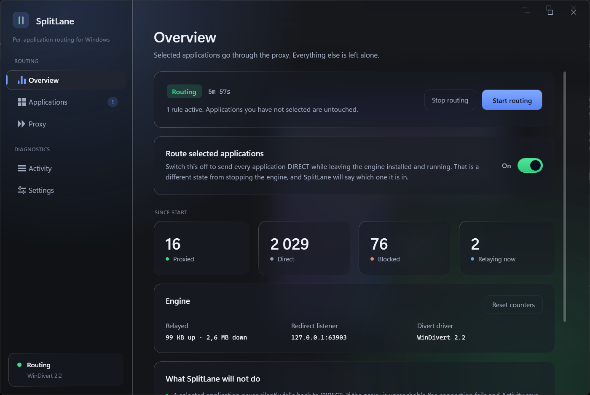
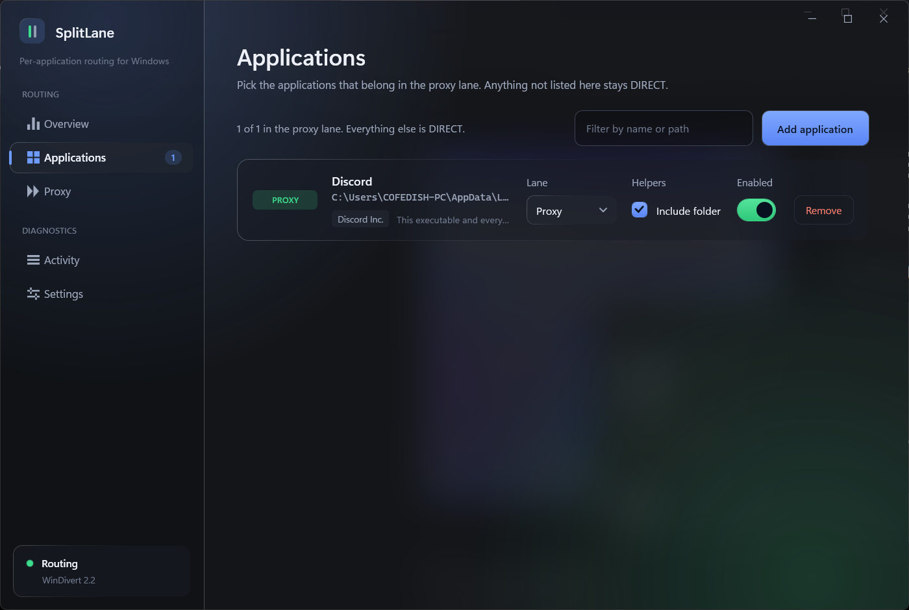
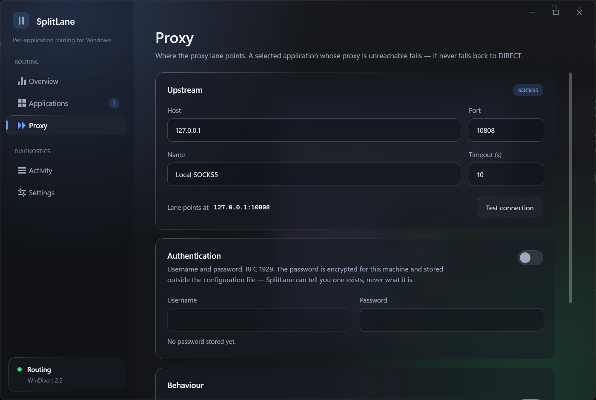
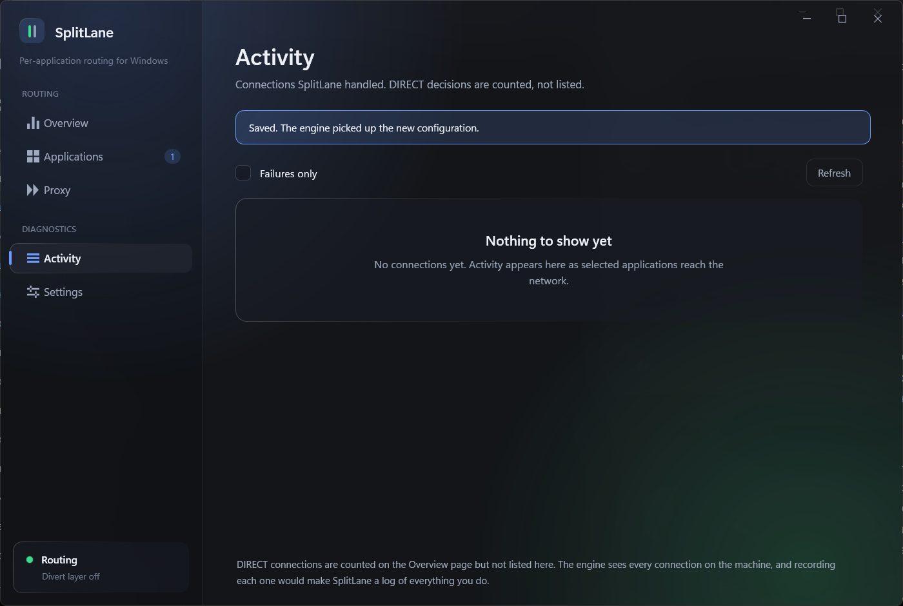
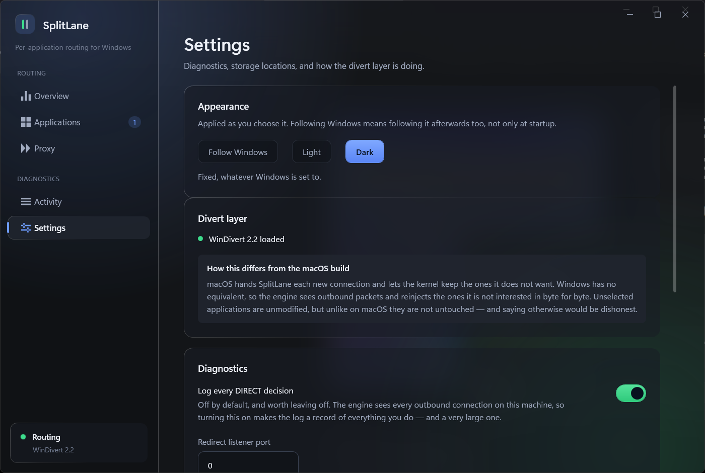
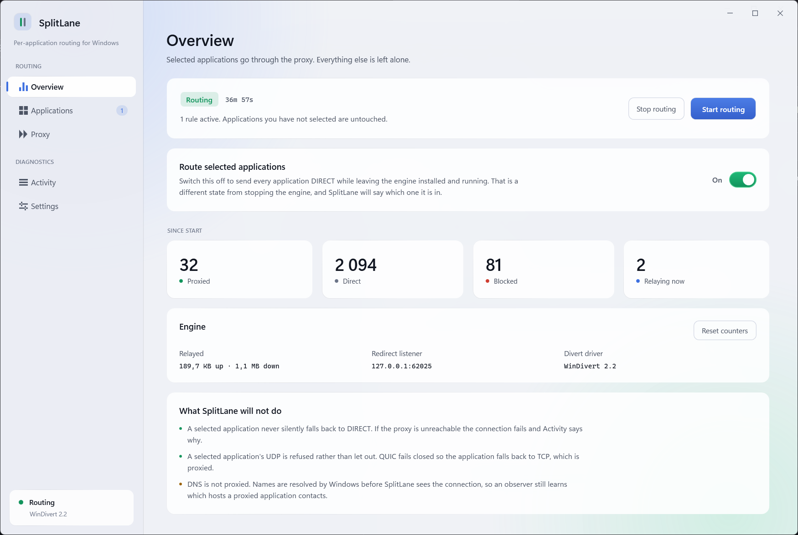

# SplitLane for Windows

Per-application network routing for Windows. Put selected applications in a proxy lane; leave
everything else alone.

```
                         SplitLane
                            │
                 identify source application
                            │
              ┌─────────────┴─────────────┐
              │                           │
        selected app                unselected app
              │                           │
          PROXY lane                 DIRECT lane
              │                           │
              ▼                           ▼
    SOCKS5 127.0.0.1:10808          normal Windows
              │                     networking
              ▼
           Internet
```

Selected applications launch normally from the Start menu. No wrapper script, no `HTTP_PROXY`, no
launcher.

This is the Windows counterpart of the macOS build in the repository root. It is a port of the
design, not of the code: the routing model, the vocabulary and the guarantees are the same, and
almost nothing underneath them is.

## What it looks like



The Overview page while routing: what is proxied, what went DIRECT, what was blocked, how much has
been relayed, and which driver is loaded. Everything on it is read from the running engine.

| | |
|---|---|
|  |  |
| **Applications** — the proxy lane. Anything not listed here stays DIRECT. A rule records who signed the application, not where it was, so it follows the application through updates and moves. *Include folder* also covers its helper processes. | **Proxy** — where the lane points, with a reachability test that actually connects. The password is encrypted for the machine and stored outside the configuration file. |
|  |  |
| **Activity** — connections SplitLane handled, with what each one moved and how long its handshake took. DIRECT decisions are counted but not listed: the engine sees every connection on the machine, and recording them all would make this a log of everything you do. | **Settings** — the divert layer's state, where things are stored, and a plain statement of how this differs from the macOS build. |



A light theme, chosen in Settings and applied as you choose it. *Follow Windows* is the default and
keeps following it afterwards, not only at startup.

Every one of these is the real application, driven through UI Automation by
[`tools/uiprobe`](tools/uiprobe/) and captured from the screen. Nothing here is a mockup or a
rendering, and the numbers in them are traffic that actually went through the proxy.

## What makes it different

**Selected applications never silently fall back to DIRECT.** If the proxy is unreachable, the
connection fails and the UI says why. A silent fallback is a leak the user cannot see, which is
worse than a visible error.

**Selected-application UDP goes through the proxy or nowhere.** Datagrams are relayed through a
SOCKS5 UDP association by default (ADR W-0012), so an application with no TCP fallback, such as
voice, is not simply cut off. When they cannot be relayed — relaying switched off, a proxy that
refuses `UDP ASSOCIATE`, all 64 lanes in use, or an IPv6 datagram — they are dropped. They are never
sent DIRECT.

**A rule is an application, not a path.** It records the verified publisher, product and file name,
or the package family Windows gives the process, so it keeps matching when the application updates
itself into a new directory or is moved (ADR W-0013). A file at a rule's recorded location that is no
longer that application — unsigned, another signer, other bytes — is blocked, not routed and not let
out DIRECT.

## How it differs from the macOS build

This is the honest headline, and it is worth reading before anything else.

macOS gives SplitLane `NETransparentProxyProvider`. The provider is handed each new flow and returns
`false` for the ones it does not want, at which point the kernel keeps the flow and **nothing is
recreated, rewritten or copied**. That is what makes "unselected applications are untouched"
literally true there.

Windows has no supported equivalent. What it has is packet interception. So on Windows:

| | macOS | Windows |
|---|---|---|
| Interception point | flow, before a socket exists | packets, via WinDivert |
| Application identity | code signing identifier on the flow | process id at connect time → image path → verified signer + product + file name, package family from the process token, or file hash |
| Unselected traffic | never leaves the kernel | copied to user mode and reinjected byte-for-byte |
| Selected TCP | new socket, relayed | destination-NATed to a loopback listener, relayed |
| Selected UDP | flow refused | redirected to a loopback lane and relayed through SOCKS5 `UDP ASSOCIATE`; dropped when it cannot be |
| Privilege | system extension + Apple entitlement | administrator to install; a LocalSystem service + a signed third-party driver |

Unselected applications are **unmodified**, and SplitLane never changes a byte of their traffic. But
they are not *untouched*, and claiming otherwise would be dishonest. The cost is real: on a busy
machine the engine sees every outbound packet, for as long as it is routing — including while
routing is paused and while no rule selects anything. See [docs/NETWORKING.md](docs/NETWORKING.md).

## Requirements

- Windows 10 2004 or later, 64-bit. Windows 11 for the glass interface at its best.
- .NET 10 SDK to build.
- [WinDivert](https://github.com/basil00/WinDivert) 2.2 or later. The MSI and the portable archive
  include it; a source checkout fetches it with a script, because it is not committed to this
  repository.
- Administrator rights to install. The installed product does not need them to run: the engine is a
  LocalSystem service and the app runs as a normal user. Only running the engine by hand — from a
  source checkout or the portable archive — needs an elevated prompt.

## Build

```powershell
cd windows

dotnet build SplitLane.Windows.slnx      # everything
dotnet test  SplitLane.Windows.slnx      # 586 tests, no network, no driver, no elevation
```

`SplitLane.Core` targets plain `net10.0`, has no package references and P/Invokes nothing, so the
whole routing model is testable with `dotnet test` alone. That mirrors the macOS project's promise
that `swift test` works without Xcode.

## Run

**Installed**, there is nothing to run: the MSI includes the divert driver and registers the engine
as a service that starts with Windows. Open SplitLane and it is already routing.

From a source checkout the driver is not in the tree and the engine is not a service, so:

```powershell
# 1. Fetch the divert driver (once). Verified against a pinned hash.
.\tools\fetch-windivert.ps1

# 2. Check what stands in the way. Unelevated, this reports only whether the driver library is
#    present and whether the prompt is elevated; from an elevated prompt it also loads the driver.
.\src\SplitLane.Engine\bin\x64\Debug\net10.0-windows\win-x64\SplitLane.Engine.exe --check

# 3. Start the engine from an ELEVATED prompt.
.\src\SplitLane.Engine\bin\x64\Debug\net10.0-windows\win-x64\SplitLane.Engine.exe

# 4. Start the app as a normal user.
.\src\SplitLane.App\bin\x64\Debug\net10.0-windows\SplitLane.exe
```

The paths are where `dotnet build SplitLane.Windows.slnx` puts them: the solution builds for `x64`,
so the output is under `bin\x64\Debug`, not `bin\Debug`.

Without a driver, the engine still runs everything except interception:

```powershell
SplitLane.Engine.exe --no-divert
```

The control channel, the rule engine, the SOCKS5 relay and the redirect listener all work; the UI
says plainly that nothing is being routed. This is how the interface is developed and demonstrated,
and how you can verify your proxy settings before installing a kernel driver.

## Architecture

```
SplitLane.Core        pure C# — models, rule engine, SOCKS5 codec, configuration, policy, IPC contracts
SplitLane.Engine      LocalSystem service — WinDivert, NAT redirector, relay, identity, control channel
SplitLane.App         WPF — rules, proxy, activity, settings. Never elevated.
src/Shared            identity readers (signature, file stamp, hash, package family), compiled into App and Engine
```

Dependencies run one way: `App → Core`, `Engine → Core`. The core imports neither WPF nor WinDivert,
which is what keeps it testable. `src/Shared` is linked source rather than a project, so the app
building a rule and the engine checking a process read an application's identity with the same code.

The engine is the only component with administrative rights, and the named pipe between the two is
the trust boundary. Everything the app can ask the engine to do is a closed enum with eleven members;
there is deliberately no message that names a file to open, a command to run, or a library to load.

## Honest limitations

- **DNS is not proxied.** Windows resolves the name in the DNS Client service before SplitLane sees
  the connection. A network observer still learns which hosts a proxied application contacts. The
  engine sniffs DNS *answers* to recover hostnames for `ATYP=DOMAIN`, which improves CDN behaviour
  and does nothing whatsoever for privacy.
- **Unselected traffic transits user mode.** See the comparison table above. This is the single
  largest behavioural difference from macOS.
- **Pausing is not switching off.** While the engine is routing, its divert handles are open whether
  or not any rule selects anything; pausing makes every decision DIRECT but packets still pass
  through the engine. Only stopping routing closes the handles.
- **Selected-application UDP is dropped when it cannot be relayed.** With relaying off, a proxy that
  refuses `UDP ASSOCIATE`, all 64 lanes in use, or an IPv6 datagram, the datagrams go nowhere. An
  application with no TCP fallback then fails rather than leaking.
- **Identity is verified on the file on disk, not on the running image.** A rule matches a signed
  application by verified publisher, product name and file name, and a packaged one by the package
  family in its process token (ADR W-0013). The signature is checked on the file at the image path,
  not on the mapped image; tricks that make the two differ need local code execution, and
  application control (WDAC/AppLocker) is the defence against those, not a routing product. Tracked
  as W-2.
- **Rules follow signed applications, not unsigned ones.** A signed application keeps its rule
  through updates and moves; a publisher that changes its certificate subject loses it, visibly —
  blocked at the recorded location, DIRECT elsewhere, logged either way. An unsigned application is
  pinned to its exact bytes, so after every update it has to be selected again, and its helpers are
  never included.
- **The first connection after an update waits about a second.** A new build of a selected
  application is verified before any of its traffic is routed; its first SYN is held and the
  retransmission a second later is the one that goes through.
- **Family matching is refused for shared directories and platform products.** Ticking "include
  folder" on a binary in `C:\Windows\System32` would put the operating system in the proxy lane, so it
  is not allowed (ADR W-0003), and neither is a family on a product such as Windows, .NET, Electron
  or Node.js, which other people's applications are built on (W-0013).
- **The managed policy is engine-side only.** An administrator-owned
  `%ProgramData%\SplitLane\Policy\policy.json` can mandate rules users cannot override (ADR W-0014),
  and the engine enforces it. The app does not yet show managed rules, or that a policy is in force.
  Fleet readiness is assessed in [docs/ENTERPRISE_READINESS.md](docs/ENTERPRISE_READINESS.md): not
  ready.
- **"Why is this application not routed?" has a command.** `SplitLane.Engine.exe --explain` shows
  which rule matches which running process and why, and `--describe <exe>` prints the identity a
  rule for that file would record. Both are read-only and need no elevation.
- **Interception is verified, some conditions are not.** A selected application's traffic has been
  confirmed reaching the proxy on a live machine, from the upstream side, and under load: six
  applications at once, 600/600 requests proxied with every payload intact. Identity matching is
  unit- and integration-tested but has not yet been run under the driver. IPv6, sleep and resume, and
  a network that changes underneath it have not been exercised.

## Documentation

| | |
|---|---|
| [ARCHITECTURE.md](docs/ARCHITECTURE.md) | Modules, boundaries, the flow lifecycle |
| [NETWORKING.md](docs/NETWORKING.md) | How interception actually works, and what it costs |
| [THREAT_MODEL.md](docs/THREAT_MODEL.md) | Security analysis and what is unverified |
| [ENTERPRISE_READINESS.md](docs/ENTERPRISE_READINESS.md) | What stands between this and a managed fleet |
| [DEVELOPMENT.md](docs/DEVELOPMENT.md) | Build, run, test, and the UI screenshot harness |
| [adr/](docs/adr/) | Decision records for the Windows-specific choices |
